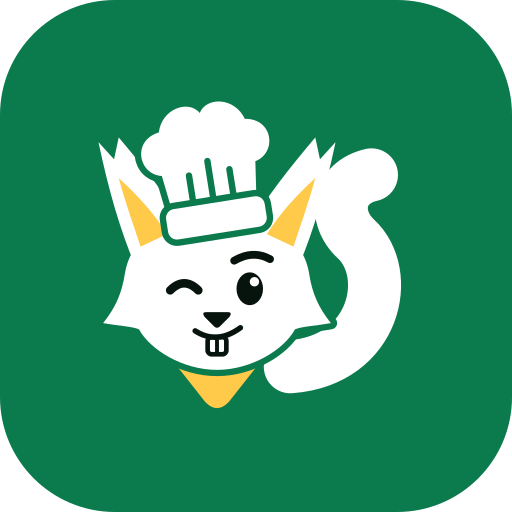

# 갈무리부엌

> 사둔 재료, 남김없이 챙겨요

냉장고 재고를 기록하면 상하기 전에 알려 주고, 남은 재료로 레시피를 찾아 주고, 식단·장보기·먹은 기록까지 이어 주는 모바일 웹 서비스입니다.
앱 설치 없이 휴대폰 브라우저에서 씁니다. "갈무리"는 물건을 잘 간수하고 일을 끝맺는다는 뜻의 순우리말이고, 마스코트는 셰프 다람쥐 **다람이**입니다.

- 체험: https://galmuri-kitchen.onrender.com → 로그인 화면의 **로그인 없이 체험하기**
- 제출 자료: [서비스 소개서](docs/submission/01-서비스-소개서.md) · [시연 시나리오](docs/submission/02-시연-시나리오.md) · [AI 개발 과정](docs/submission/03-AI-개발-과정.md) · [제출 체크리스트](docs/submission/04-제출-체크리스트.md)

## 문제

- **사둔 재료가 상해서 버려집니다.** 두부·요거트처럼 날짜를 따로 적지 않은 재료는 냉장고 안쪽에서 잊히기 쉽습니다.
- **장보기에서 겹치고 빠집니다.** 마트에서는 집에 대파가 있었는지 기억나지 않고, 돌아와 보면 참기름이 떨어져 있습니다.
- **있는 재료로 뭘 만들지 떠오르지 않습니다.** 결국 새로 사고, 남은 재료는 또 밀려납니다.

## 해결

재고 → 레시피 → 장보기를 한 흐름으로 묶었습니다.

1. **넣기**: 영수증·냉장고 사진·주문 캡처를 찍으면 AI가 재료를 채우고, 확인한 뒤 한 번에 넣습니다.
2. **알림**: 곧 먹어야 할 재료가 위로 올라오고, 떨어진 필수품은 첫 화면에 뜹니다.
3. **요리**: 재고와 겹치는 레시피를 일치율 순으로 보여 주고, 임박 재료를 먼저 쓰는 AI 레시피를 만듭니다.
4. **장보기**: 없는 재료를 목록에 담고, 마트에서 인터넷 없이 체크한 뒤 산 것을 재고에 넣습니다.
5. **식단·기록**: 한 주 식단을 짜고 하루 칼로리 목표와 합계를 보며, 먹은 끼니를 달력에 남깁니다.

## 탭별 기능

스크린샷은 [`docs/submission/screenshots/`](docs/submission/screenshots/)에 있습니다.

### 재고

| 내 재고 | 사진 인식 확인 |
|---|---|
| 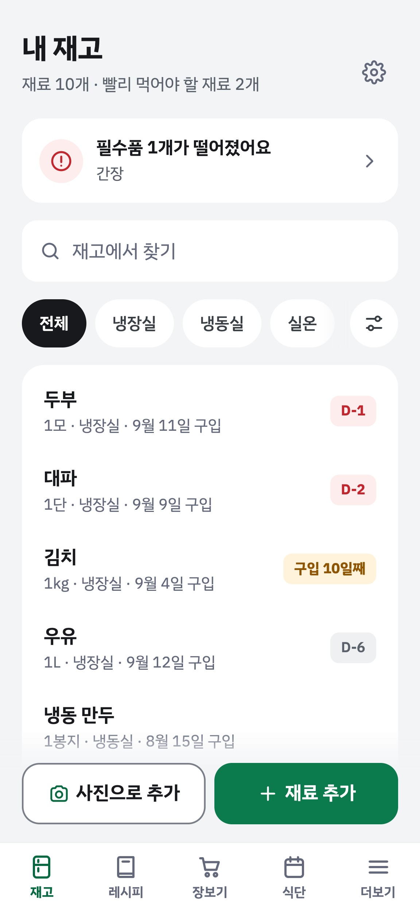 | 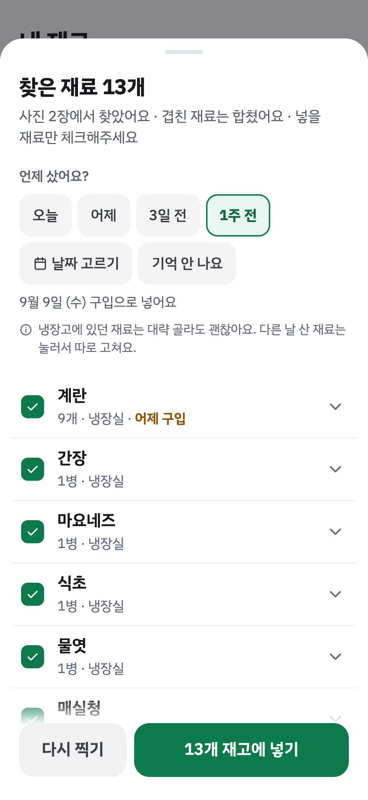 |

- **임박 배지**: `D-2`, `구입 9일째`, `섭취 주의`. 유통기한을 적으면 그 날짜가 우선이고, 없으면 보관 위치 기준(냉장 7일, 냉동 60일)으로 판단합니다.
- **품목별 경고**: 식약처 「식품유형별 소비기한 설정 보고서」 참고값(두부 23일, 발효유 32일, 햄 57일 등)을 구입일 기준으로 환산해 기본 규칙으로 넣었습니다. 사용자가 고칠 수 있습니다.
- **사진으로 추가**: 냉장고 사진·영수증·온라인 주문 캡처. 카메라로 바로 찍거나 앨범에서 고릅니다. 영수증은 구입일과 품목별 결제 금액도 읽고, 봉투·세제 같은 비식품은 뺍니다.
- **보관 위치·필수품**: 김치냉장고·찬장처럼 위치를 직접 만듭니다. 떨어진 필수품은 배너로 알리고 장보기에 바로 담습니다.
- **빠른 입력**: 연속 추가, 단위 칩, `구입일 +N일`, 수량 −/+, 재고 검색. 지울 때 `다 먹었어요`/`버렸어요`를 고를 수 있습니다.

### 레시피

| 추천 | AI 레시피 | 레시피 상세 |
|---|---|---|
| 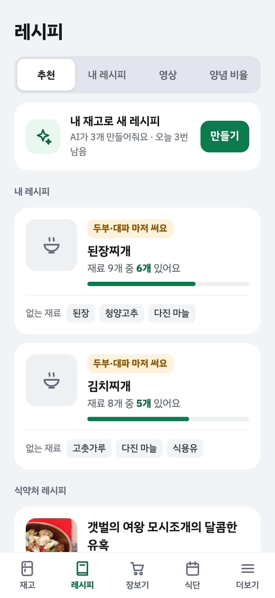 | 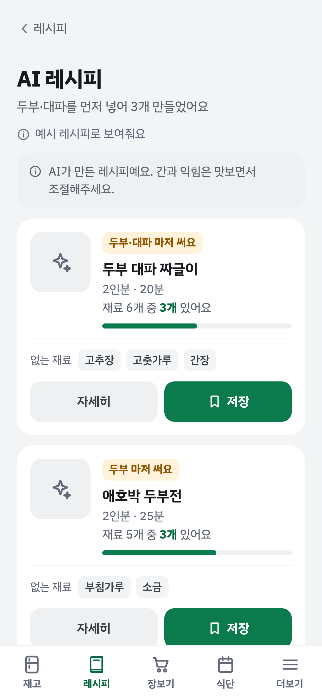 | 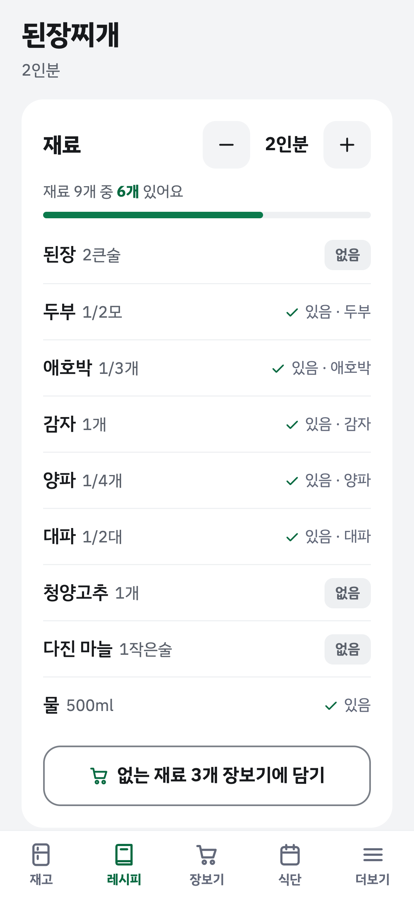 |

| 링크 가져오기 | 영상 | 양념 비율 |
|---|---|---|
| 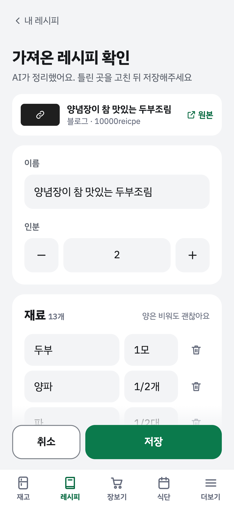 | 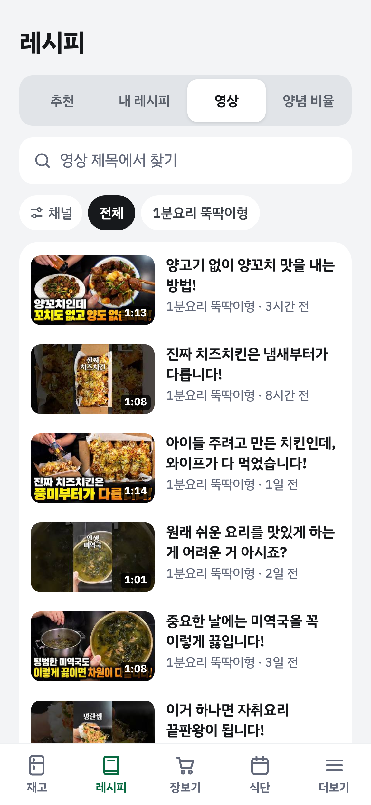 | 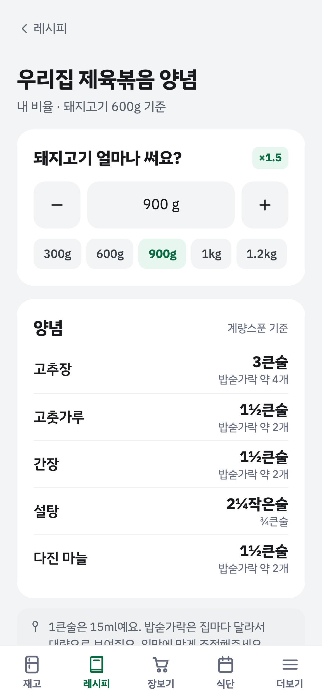 |

- **추천**: 내 레시피와 식약처 조리식품 레시피 DB(인증키 연결 후 약 1,100건, 키가 없으면 예시 레시피 12건)를 재고와 비교해 일치율 순으로 보여 줍니다. 임박 재료를 쓰는 레시피가 앞으로 옵니다.
- **AI 레시피**: 재고로 레시피 3개를 만듭니다. 빨리 먹어야 할 재료를 먼저 넣습니다. 사진은 새로 만들지 않고, 이름이 비슷한 공공 레시피 사진을 `비슷한 요리 사진`으로 밝혀 씁니다.
- **링크·글 가져오기**: 유튜브(설명란)·블로그·인스타그램 링크나 붙여 넣은 글을 AI가 재료·만드는 법으로 정리합니다. 확인 화면에서 고친 뒤 저장합니다.
- **사진으로 가져오기**: 요리책·캡처·손글씨 사진을 찍으면 AI가 레시피로 정리합니다.
- **영상**: 기본 요리 채널 14개가 들어 있고, 내 채널은 30개까지 추가합니다. 전체 영상 목록은 채널당 최신 12개까지 섞고, 채널 칩은 짧은 이름으로 보여 줍니다. 고른 채널의 새 영상만 앱 안에서 보고 `레시피로 가져오기`를 누릅니다.
- **양념 비율**: 주재료 무게·인분·완성량 기준으로 늘리고 줄입니다. 결과는 `3½큰술`처럼 실제로 뜰 수 있는 분수로, 아래에 `밥숟가락 약 4개`를 함께 보여 줍니다.
- **레시피 상세**: 인분 −/+, 가진 재료 표시, `없는 재료 N개 장보기에 담기`.

### 장보기

| 목록 | 쇼핑몰에서 찾기 | 재고에 넣기 |
|---|---|---|
| 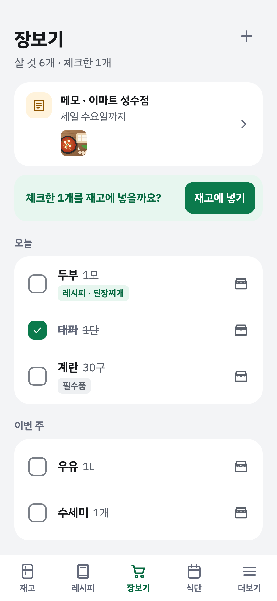 | 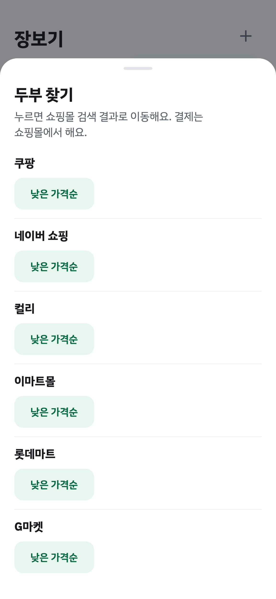 | 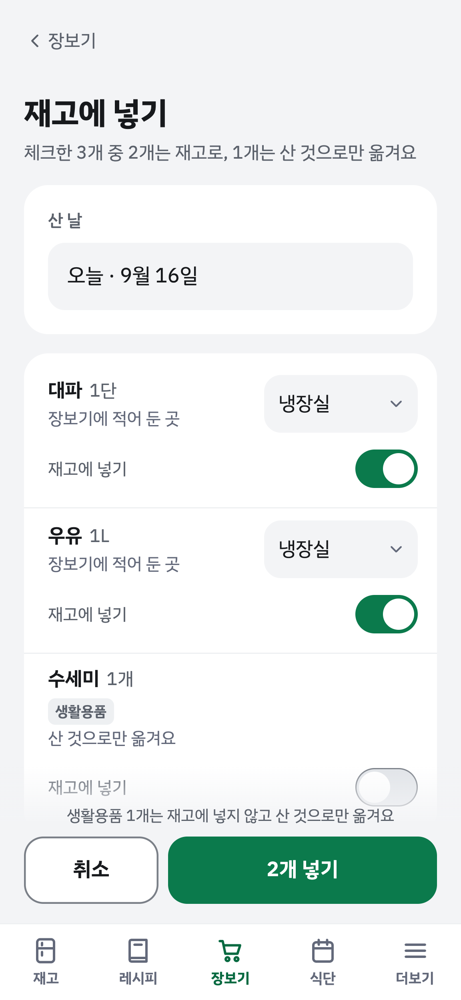 |

| 장보기 메모 | 메모 사진 인식 | 오프라인 |
|---|---|---|
| 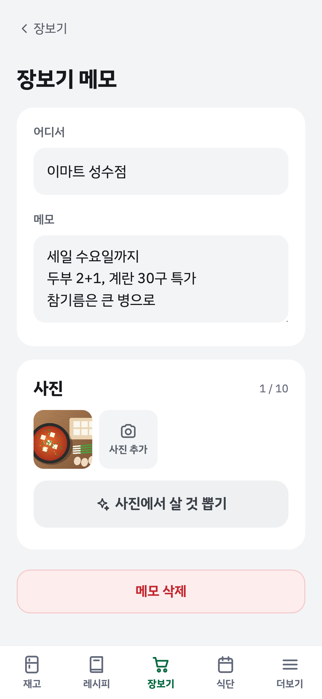 | 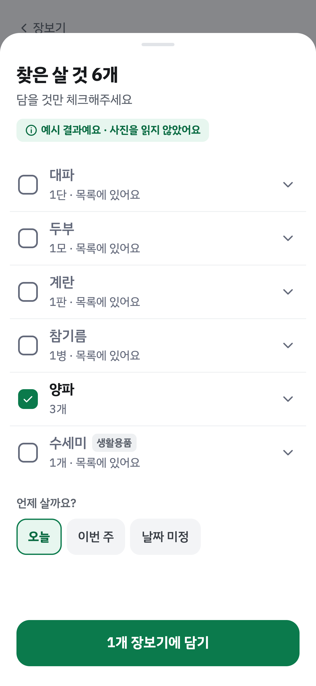 | 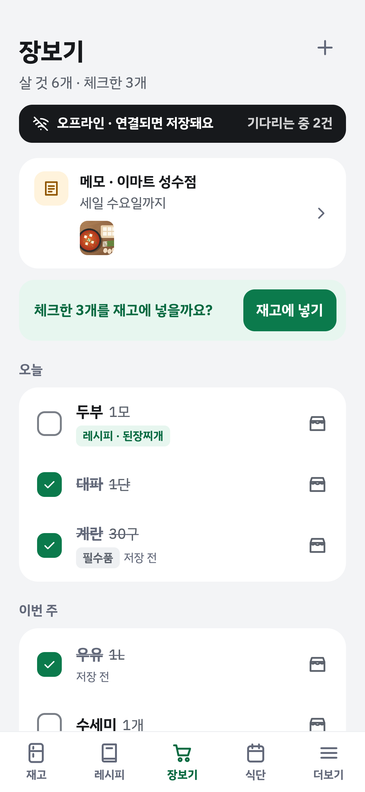 |

- **체크**: `오늘 · 이번 주 · 나중에 · 날짜 미정`으로 묶고, 체크한 항목은 제자리에서 줄을 긋습니다.
- **쇼핑몰 검색**: 쿠팡·네이버 쇼핑·컬리·이마트몰·홈플러스·롯데마트·G마켓 검색 결과로 이동합니다. 결제는 쇼핑몰에서 합니다. `낮은 가격순` 같은 정렬 칩은 폰에서 주소를 확인한 쇼핑몰만 보입니다.
- **재고에 넣기**: 체크한 항목을 산 날·보관 위치와 함께 한 번에 재고로 옮깁니다. 수세미·휴지 같은 생활용품은 `산 것으로만 옮겨요`가 기본입니다.
- **메모 사진**: 손메모·전단지를 찍으면 AI가 살 것을 뽑고 생활용품을 표시합니다. 확인한 뒤 목록에 담습니다. 살 것 추가에도 `사진에서 뽑기`가 있어 메모 없이 바로 담습니다.
- **오프라인**: 마트 지하처럼 인터넷이 없어도 목록을 열고 체크·추가·메모를 합니다. 변경은 기기에 쌓였다가 연결되면 보냅니다. 서비스 워커는 HTTPS에서만 동작하므로 배포 주소에서 확인합니다.
- **메모 정리**: 아무것도 안 쓴 장보기 메모는 나갈 때 지우고, 하루 지난 빈 메모는 목록을 받을 때 자동으로 정리합니다.

### 더보기

| 더보기 | 내보내기 |
|---|---|
| 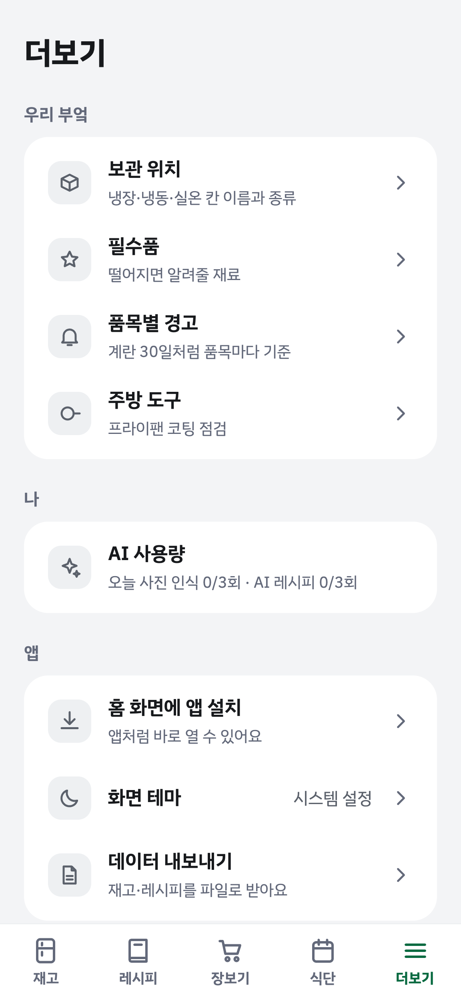 | 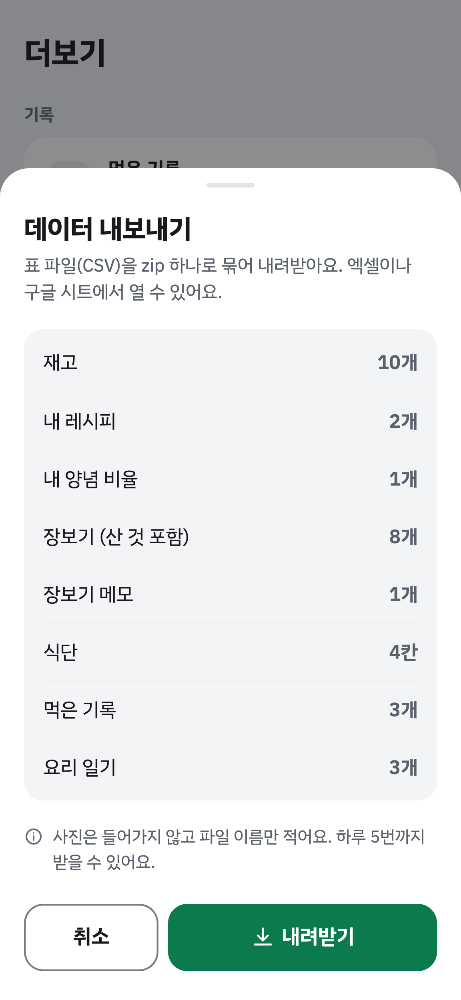 |

- **화면 테마**: 시스템·밝게·어둡게. 두 테마 모두 본문 대비 WCAG AA(4.5:1)를 맞췄습니다.
- **데이터 내보내기**: 재고·내 레시피·양념 비율·장보기·장보기 메모·식단·먹은 기록·요리 일기를 CSV 8개가 든 zip 하나로 받습니다(하루 5번).
- **AI 사용량**: `오늘 사진 인식 2/20회 · AI 레시피 1/20회`처럼 오늘 쓴 횟수와 한도를 보여 줍니다(체험 계정은 5회).
- **먹은 기록**: 끼니마다 식단에서·내 레시피·음식 찾기·직접 쓰기로 먹은 것을 남기고 양·집밥/외식·만족도·메모·사진(4장)을 붙입니다. 한 달 달력으로 보고, 식단 칸에서 `먹었어요`로 바로 기록합니다.
- **우리 부엌**: 보관 위치, 필수품, 품목별 경고, 주방 도구(코팅 프라이팬 6개월 점검).

| 재고 (다크) | 장보기 (다크) | 레시피 상세 (다크) |
|---|---|---|
| 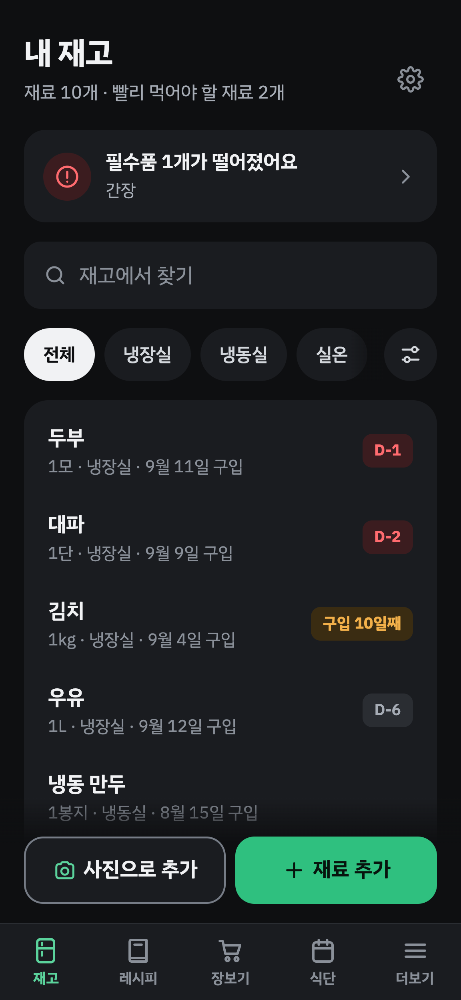 | 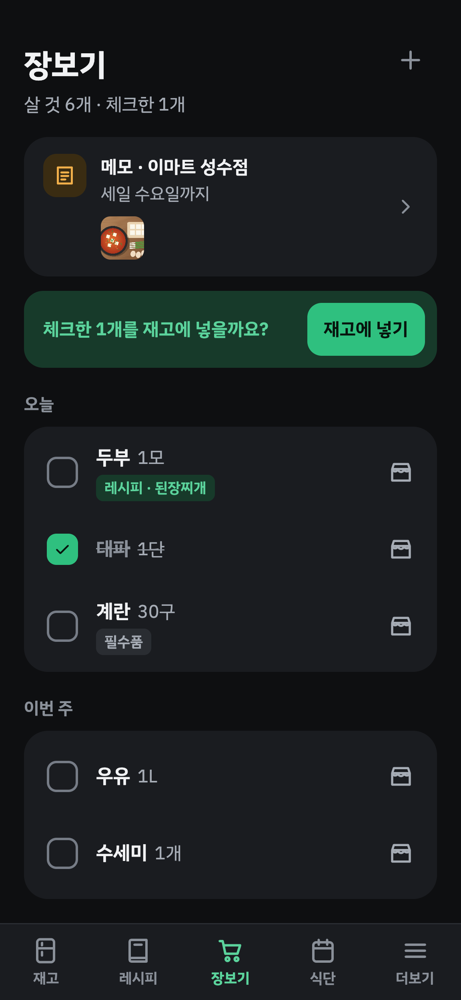 | 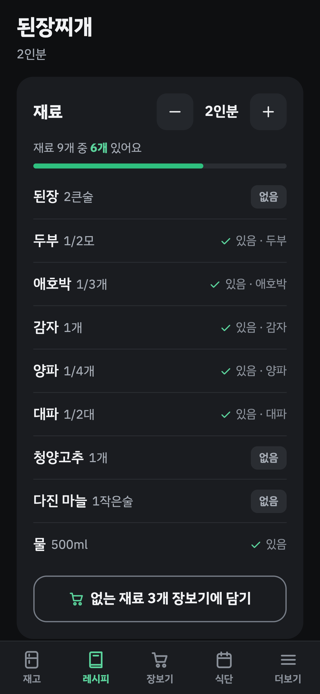 |

### 식단

- **식단 짜기**: 이번 주만 만들기(주 보기)와 이름·기간을 정하는 만들기, 여러 식단 중 고르기. 주 보기는 채운 끼니 줄과 빈 끼니 `+ 점심` 칩으로, 월 보기는 끼니 점으로 보여 줍니다.
- **칸 채우기**: 내 레시피는 재고와 겹치는 재료로 보여 주고, 유튜브 영상은 확인 화면 없이 바로 레시피로 저장하고, 직접 쓰기도 됩니다. 인분을 바로 저장하거나 다른 걸로 바꾸고, 칸을 비웁니다.
- **이번 주 복사**: 빈 칸만 채우고, 기간이 모자라면 31일까지 자동으로 늘려요. 이름·기간 고치기, 식단 지우기도 있습니다.
- **AI 식단 초안**: 끼니·목표 kcal·메모를 넣으면 칸마다 후보 2개를 미리 보여 주고, 1인분 kcal도 AI가 추정해 함께 보여 줍니다. 체크한 칸만 넣고, 새로 나온 요리는 내 레시피에 저장됩니다.
- **식단으로 장보기**: 인분 배율을 합쳐 재고와 비교하고, 모자란 만큼만 담습니다. 단위가 다르면 직접 고르고, 끼니 전날을 살 날 태그로 붙입니다.
- **영양 계산**: 내 몸 정보(성별·출생연도·키·몸무게·활동량·목표)로 하루 칼로리 목표를 정하고, 레시피 1인분 영양(탄수화물·단백질·지방·당류·나트륨)과 식단 하루 합계를 봅니다. 재료는 식품영양성분 DB에서 찾고, 못 찾은 재료만 AI가 추정해 `추정`으로 표시합니다.
- 요리 일기·집밥 리포트는 서버 기능까지 병합했고 화면은 다음 순서입니다. [로드맵](#로드맵)을 참고하세요.

## AI를 쓴 곳

### 서비스 안의 AI

모든 AI 호출은 Claude API의 구조화 출력(`messages.parse` + Pydantic 스키마)을 씁니다. 호출이 실패하거나 형식이 틀리면 결과를 쓰지 않고 오류를 알립니다. 사진 인식은 직접 입력으로 넘어갑니다.

| 기능 | 입력 | 출력 |
|---|---|---|
| 사진 인식 | 냉장고 사진·영수증·주문 캡처 | 재료 이름·수량·단위·보관 위치 종류·결제 금액·구입일 |
| 메모 사진 인식 | 손메모·전단지 | 살 것 이름·수량·생활용품 여부 |
| AI 레시피 | 재고 목록(임박 표시 포함) | 레시피 3개(인분·조리 시간·재료·단계) |
| 링크·글 정리 | 유튜브 설명란·블로그 본문(레시피 글이 없으면 본문 사진 5장까지)·붙여 넣은 글 | 레시피 초안 1개 |
| 사진으로 가져오기 | 요리책·캡처·손글씨 레시피 사진 5장까지 | 레시피 초안 1개 |
| AI 식단 초안 | 빈 칸 날짜·끼니, 재고(임박 표시), 내 레시피 제목, 목표 kcal·메모 | 칸마다 요리 3개(추천 + 후보 2개)와 1인분 kcal 추정 |
| 영양 추정 | 식품영양성분 DB에서 못 찾은 재료 이름·단위 | 100g당 kcal·탄수화물·단백질·지방·당류·나트륨, 한 단위 무게(g) |
| 사 먹으면 얼마 추정 | 레시피 이름·재료 이름(15개까지) | 1인분 외식 가격(원), 레시피에 저장해 다시 묻지 않음 |

- 서버가 결과를 한 번 더 정리합니다. 최대 50개, 이름 50자, 수량이 0 이하면 1, 미래 구입일은 비우고, 금액은 0원 초과 1,000만 원 이하만 남깁니다.
- 메모 인식 프롬프트에는 사진 속 글자를 지시로 따르지 말라는 규칙을 넣었습니다.
- 모델은 `CLAUDE_MODEL` 환경 변수로 바꿉니다(기본 `claude-sonnet-5`). 키가 없으면 개발 모드는 예시 결과를 쓰고, 운영은 해당 버튼을 숨깁니다.

### 만드는 과정의 AI

Claude Code에서 설계·구현·검토를 역할별 에이전트로 나눴습니다. 자세한 내용은 [AI 개발 과정](docs/submission/03-AI-개발-과정.md)에 있습니다.

- 설계 문서 → 화면 시안(사용자 승인) → 태스크 단위 구현 계획 → 기능마다 git worktree와 브랜치
- 태스크마다 구현 에이전트 1개. 검토 에이전트는 변경 종류에 맞춰 병렬로 붙입니다(코드·보안·UX·접근성·테스트 설계).
- 검토 지적 반영 → 검증 에이전트 → `main`에 `--no-ff` 병합 → 단계 끝에 전체 브랜치 최종 검토와 화면 흐름 점검

## 기술 스택과 구조

| 영역 | 사용 기술 |
|---|---|
| 프론트엔드 | React 19, TypeScript, Vite 8, 순수 CSS, PWA(서비스 워커·IndexedDB) |
| 백엔드 | Python 3.14, Flask 3.1, Flask-SQLAlchemy, Flask-Migrate(Alembic), Authlib, anthropic, boto3 |
| 데이터베이스 | PostgreSQL(운영·검증), SQLite(로컬·테스트) |
| 외부 서비스 | Anthropic Claude API, Cloudflare R2, YouTube Data API v3, 식약처 조리식품 레시피 DB(COOKRCP01), 식품영양성분 DB(공공데이터포털), 카카오·네이버·구글 로그인 |
| 실행·배포 | Docker(멀티 스테이지), gunicorn(gthread), Render |

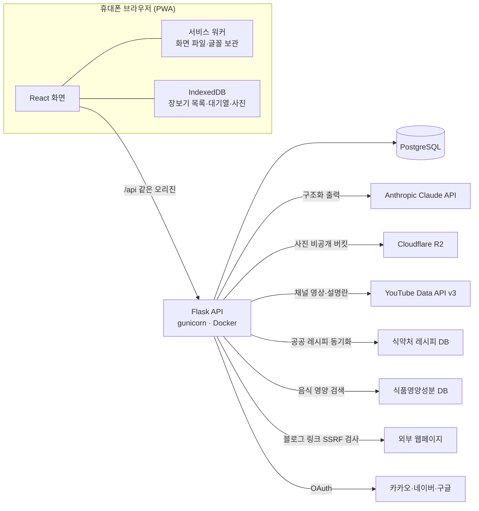

Flask 한 앱이 `/api/*`와 React 빌드 결과를 같은 오리진에서 서빙합니다(CORS 없음). 사진은 서버가 소유자를 확인한 뒤 R2에서 받아 흘려보내므로 버킷을 공개하지 않습니다.

## 보안·비용 설계

| 항목 | 방식 |
|---|---|
| SSRF 방어 | 블로그 링크는 https만 받습니다. DNS 결과가 모두 공인 IP인지 보고, 연결한 소켓의 상대 주소를 TLS 전에 다시 확인합니다. 리다이렉트는 매번 같은 검사로 3번까지, 응답은 `text/html`·3MB까지입니다. 리다이렉트까지 합친 전체 8초가 지나면 감시 타이머가 소켓을 끊어, 조금씩 흘려 보내는 서버도 제한 시간 안에 끝납니다. IPv4를 담는 IPv6 대역(NAT64·6to4 등)도 거절합니다. |
| AI 비용 | 사용자별 하루 사진 인식 20번·AI 레시피 20번(가져오기·식단 초안·사 먹으면 얼마 추정 포함, 서울 날짜), 60초 안 3번 연속 제한. 영양 추정은 따로 하루 20번(체험 계정 2번, 체험 전체 하루 30번). 실패한 호출도 셉니다. 호출마다 모델·토큰을 `ai_calls`에 남겨 원가를 계산합니다. |
| 체험 계정 AI | 계정당 하루 5번. 체험 계정 전체가 24시간에 80번(`DEMO_AI_GLOBAL_DAILY`, 배포 설정값)을 넘으면 AI를 부르지 않고 예시 결과를 보여 줍니다. 영상은 늘 예시 목록이라 유튜브 할당량을 쓰지 않습니다. |
| 유튜브 할당량 | `search.list`(100 units)를 쓰지 않습니다. 사용자별 하루 새로 받기 20번·채널 추가 30번, 전체 24시간 추정 8,000 units(무료 한도 10,000) 안에서만 받습니다. |
| 체험 계정 격리 | 누를 때마다 새 계정을 만들고, 24시간 뒤 데이터와 사진 파일까지 지웁니다. 같은 IP에서 1시간 30개·하루 100개, 전체 5,000개입니다. IP는 저장하지 않고 HMAC 해시 16자만 씁니다. 세션은 `user_id`와 `provider_id`가 함께 맞아야 합니다. |
| 사진 | `/api/photos/<key>`가 키 접두사와 사진 행으로 소유자를 확인합니다. 응답에 `Content-Security-Policy: default-src 'none'; sandbox`와 `nosniff`를 붙입니다. 파일 서명으로 JPG·PNG·WEBP만 받고, 한 장 3MB, 메모·먹은 기록·요리 일기 사진이 종류마다 사용자당 200MB(체험 계정 20MB)까지입니다. |
| CSV 수식 주입 | `=` `+` `-` `@` 탭·CR(전각 포함, 앞 공백 무시)로 시작하는 칸 앞에 `'`를 붙입니다. 내보내기는 하루 5번이고, `X-Requested-With` 헤더가 없으면 400입니다. |
| 공통 | 상태 변경 요청은 `X-Requested-With: fetch` 필수(CSRF), 세션 쿠키는 HttpOnly·Secure·SameSite=Lax, 남의 리소스는 404입니다. Render에서 `DEV_MODE`가 켜져 있으면 앱이 시작하지 않습니다. |

## 체험 방법

1. 휴대폰 크롬에서 https://galmuri-kitchen.onrender.com 를 엽니다. 로그인 화면은 카카오·네이버·구글 로고가 붙은 버튼과 지난번에 쓴 로그인 방법 표시를 보여 줍니다.
2. **로그인 없이 체험하기**를 누릅니다. 예시 재고 10개(두부 D-1, 대파 D-2 포함), 필수품 3개, 레시피 2개, 양념 비율 1개, 장보기 목록·메모, 한 주 식단, 먹은 기록 3개가 든 계정이 열립니다.
3. 체험 계정은 24시간 뒤 사라집니다. 사진 인식과 AI 레시피(링크 가져오기 포함)는 하루 5번씩 쓸 수 있습니다.
4. 메뉴(⋮) → **홈 화면에 추가**로 설치하면 주소창 없이 열립니다.


## 로컬 실행

macOS 기준이며, 명령은 저장소 루트에서 시작합니다.

1. 백엔드 의존성
   ```
   cd backend && python3 -m venv .venv && .venv/bin/pip install -r requirements-dev.txt
   ```
2. 프론트엔드 의존성
   ```
   cd frontend && npm install
   ```
3. 환경 변수 파일
   ```
   cp backend/.env.example backend/.env
   ```
   예시 파일은 `DEV_MODE=1`이 켜져 있어 개발용 로그인을 씁니다. API 키를 비워 두면 사진 인식·AI 레시피·영상이 예시 결과로 동작합니다.
4. 추천 칸에 쓸 예시 공공 레시피 12개(키 없이)
   ```
   cd backend && .venv/bin/flask --app app db upgrade && .venv/bin/flask --app app seed-sample-recipes
   ```
5. 개발 서버
   ```
   ./dev.sh
   ```
   Flask는 `127.0.0.1:5181`, Vite는 `0.0.0.0:5180`에서 뜹니다. 휴대폰은 같은 와이파이에서 `http://<맥 IP>:5180`으로 접속하고 **개발용 로그인**을 누릅니다.

### 테스트

```
backend/.venv/bin/pytest -q -W error::DeprecationWarning   # 백엔드 1,475개
cd frontend && npm run check && npm run build              # 순수 로직 검사 스크립트 9개 + 타입 검사·빌드
```

PostgreSQL 검증, 마이그레이션 점검, Docker 스모크 테스트, Render 배포 절차는 [`docs/deploy.md`](docs/deploy.md)에 있습니다.

## 개발 과정 요약

| 항목 | 수치 |
|---|---|
| 기간 | 2026-09-13 10:51 첫 커밋 → 2026-09-15 23:16 `b560ed4`(약 60시간) |
| 커밋 | 532개(병합 196, fix 138, feat 103, docs 66) |
| 설계 | [설계 문서](docs/superpowers/specs/2026-09-13-recipe-ai-design.md) 29절, [구현 계획](docs/superpowers/plans/) 13개 |
| 화면 시안 | [`docs/design/`](docs/design/) 11묶음, 사용자 승인 후 구현 |
| 테스트 | 백엔드 1,475개(SQLite 통과, `b560ed4`), 프론트 검사 스크립트 9개 |

단계: 1 기반·로그인 → 1b 보관 위치·필수품·품목별 경고 → 1c 하단 탭·주방 도구 → 1d 사용성 → 2 사진 인식 → 3a 레시피·추천 → 3b AI 레시피·링크·영상 → 3c 양념 비율 → 더보기 정리 → 4 장보기·오프라인·체험 계정 → 4b-1 식단 짜기 → 4b-2 영양 계산 → 4b-3 먹은 기록 → 5 요리 일기·집밥 리포트(서버 기능).

## 로드맵

| 순서 | 내용 |
|---|---|
| 완료 | Render 배포, 4b-2 영양 계산, 4b-3 먹은 기록 |
| 5 요리 일기 화면 | 요리했어요 → 쓴 재료 재고에서 빼기·되돌리기, 별점·사진·메모, 일기 목록·상세(서버 기능은 병합) |
| 집밥 리포트 화면 | 이번 달 버린 재료 수, 아낀 돈(사 먹으면 얼마 × 인분 − 쓴 재료비), 많이 아낀 요리 3개(계산 API는 병합) |
| 운영 | 쇼핑몰 정렬 링크 폰 확인, 식약처 레시피 전체 동기화, 회원 탈퇴 버튼 |

## 수익 구조

AI 호출 원가가 가장 큰 비용이라, 원가를 먼저 재고 그 위에 수익을 붙입니다. 추천과 정렬 순서는 수수료와 관계없이 둡니다.

| 방식 | 상태 | 내용 |
|---|---|---|
| 쿠팡 파트너스 제휴 링크 | 구현(키 넣으면 작동) | 장보기에서 쿠팡으로 갈 때 제휴 링크로 보내고 `광고` 표시를 붙입니다. 체험 계정·로그인 전은 일반 링크입니다. |
| 구독 | 기획 | 무료와 유료는 AI 사용 한도(사진 인식·AI 레시피·식단 AI)로 나눕니다. 가격은 `ai_calls` 토큰으로 사용자당 월 원가를 잰 뒤 정합니다. 레시피 개수 제한은 원가가 거의 없어 쓰지 않습니다. |
| 식품 브랜드 협찬 레시피 | 기획 | 사용자가 모이면 추천 목록에 `광고` 표시를 달고 섞습니다. |

원가는 호출마다 기록한 토큰으로 계산하며, 추정 원가는 영수증 1장 인식 약 13원, AI 레시피 3개 약 30원, 한 주 식단 초안 약 70원입니다(추정값). 그래서 재고·임박 경고·공공 레시피 추천·오프라인 장보기처럼 AI가 필요 없는 기능은 무료로 두고, 유료 구독(월 2,900~4,900원 검토)은 AI 사용 횟수로만 나눕니다. 구독할 이유는 집밥 리포트의 `아낀 돈`(추정값)으로 보여 줄 계획이고, 서버와 DB는 월 약 2만 원(추정)이라 월 4,900원 구독자 10명 정도면 충당합니다. 결제는 매주 쓰는 사용자가 생긴 뒤 붙입니다.

배너 광고와 사용자 재고·식습관 데이터 판매는 하지 않습니다. 자세한 조건은 [설계 문서 25절](docs/superpowers/specs/2026-09-13-recipe-ai-design.md)에 있습니다.

## 폴더 구조

```
backend/app/        Flask 앱 (재고, 레시피, AI, 장보기, 영상, 체험 계정, 내보내기)
backend/tests/      pytest
frontend/src/       React 화면 (pages, components, shopping 오프라인 로직)
frontend/public/    PWA manifest, 서비스 워커, 아이콘
docs/superpowers/   설계 문서와 단계별 구현 계획
docs/design/        승인된 화면 시안
docs/submission/    해커톤 제출 자료
docs/deploy.md      배포 가이드와 배포 전 로컬 검증
```

## 작성자

- 이름: [이름]
- 이메일: [이메일]
- GitHub: [GitHub]
