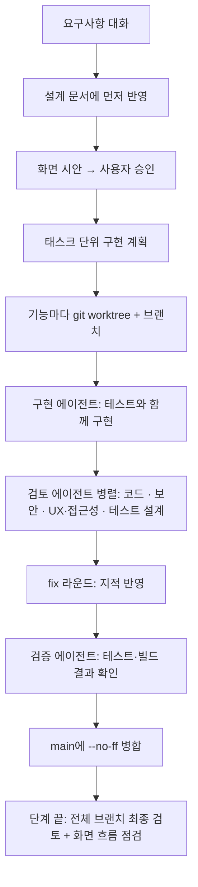

# 갈무리부엌 AI 개발 과정

갈무리부엌은 Claude Code로 만들었습니다. 사람은 무엇을 만들지 정하고 시안을 승인했고, 설계 문서·구현·테스트·검토는 역할을 나눈 에이전트가 맡았습니다.
이 문서는 그 방식과 실제로 잡힌 문제, 사람이 내린 결정을 정리합니다. 근거는 저장소의 설계 문서, 구현 계획, git 기록입니다.

## 1. 숫자로 본 과정

| 항목 | 수치 | 확인 방법 |
|---|---|---|
| 기간 | 2026-09-13 10:51 첫 커밋 → 2026-09-14 15:49 4단계 병합 | `git log --reverse --format=%ad` |
| 커밋 | 289개 | `git log --oneline \| wc -l` |
| 기능 브랜치 병합 | 101개(`--no-ff`) | `git log --merges` |
| 커밋 종류 | feat 52 · fix 78 · docs 39 | 커밋 제목 접두사 |
| 검토 반영 fix 커밋 | 26개(병합 제외, 제목에 "리뷰"·"검토") | 커밋 제목 |
| 설계 문서 | 1개, 28절 | [`docs/superpowers/specs/`](../superpowers/specs/2026-09-13-recipe-ai-design.md) |
| 구현 계획 | 9개(단계별) | [`docs/superpowers/plans/`](../superpowers/plans/) |
| 화면 시안 | 6묶음 54장 | [`docs/design/`](../design/) |
| 백엔드 테스트 | 802개(파일 29개), SQLite·PostgreSQL 모두 통과 | `pytest --collect-only` |
| 프론트 검사 | 순수 로직 검사 스크립트 4개 + 타입 검사·빌드 | `npm run check && npm run build` |

## 2. 작업 흐름

한 기능이 `main`에 들어가기까지 아래 순서를 거칩니다.

| 단계 | 누가 | 무엇을 |
|---|---|---|
| 설계 | 사용자 + 리드 에이전트 | 요구사항이 늘면 코드보다 설계 문서를 먼저 고칩니다. 결정에는 `(사용자 결정 2026-09-13)`처럼 날짜와 출처를 남깁니다. |
| 시안 | 리드 에이전트 → 사용자 | 화면을 바꾸기 전에 시안을 보여 주고 승인을 받습니다. 승인한 시안은 `docs/design/`에 둡니다. |
| 계획 | 리드 에이전트 | 태스크마다 바꿀 파일, 검증 문구, 테스트, 커밋 메시지까지 적습니다. 병렬로 할 수 있는 태스크를 표시합니다. |
| 구현 | 태스크마다 구현 에이전트 1개 | 자기 worktree에서만 작업하고, 공용 개발 서버 대신 자기 포트를 씁니다. |
| 검토 | 변경 종류별 검토 에이전트 | 백엔드는 코드·보안·테스트, 화면은 코드·UX·접근성, 오프라인 로직은 테스트 설계를 붙입니다. 여러 검토 에이전트가 병렬로 봅니다. |
| 검증 | 검증 에이전트 | 작성자와 다른 에이전트가 테스트·빌드를 다시 돌려 결과로 판단합니다. |
| 단계 마무리 | 상위 모델(opus) 최종 검토 | 단계 전체 브랜치를 한 번에 보고, 화면 흐름을 처음부터 끝까지 따라가며 점검합니다. 지적은 `fix/phase*-final-review` 브랜치로 반영합니다. |

단계별 마무리 병합 시각은 git 기록에 남아 있습니다.

| 단계 | 내용 | 마무리 병합 |
|---|---|---|
| 1b | 보관 위치·필수품·품목별 경고 | 09-13 14:24 `fix/phase1b-review` |
| 1c | 하단 탭·주방 도구 | 09-13 15:29 `fix/phase1c-review` |
| 1d | 사용성(연속 추가·검색·매칭 오탐) | 09-13 16:35 `fix/phase1d-final-review` |
| 2 | 사진 인식 | 09-13 20:43 `fix/phase2-final-review` |
| 3a | 레시피·추천 | 09-14 09:05 `fix/phase3a-final-review` |
| 3b·3c | AI 레시피·링크·영상·양념 비율 | 09-14 12:01 `fix/phase3b3c-final` |
| 4 | 장보기·오프라인·체험 계정 | 09-14 15:49 `fix/phase4-fix-frontend` |

## 3. 검토에서 잡힌 문제

구현 직후 테스트로는 드러나지 않았고, 검토 에이전트나 다음 태스크에서 잡힌 문제들입니다.

### SSRF: 조금씩 흘려 보내는 서버가 시간 제한을 넘김

- **상황**: 블로그 링크 가져오기는 서버가 외부 주소를 부릅니다. 사설 IP 차단은 있었지만, 응답을 아주 조금씩 보내는 서버는 8초 제한을 넘겨 요청 스레드를 붙잡을 수 있었습니다.
- **반영**: 리다이렉트까지 합친 전체 8초를 감시 타이머가 재고, 시간이 지나면 소켓을 끊습니다. 본문은 작게 읽으며 매번 남은 시간을 확인합니다. 연결은 DNS 검사를 통과한 IP 하나에만 하고, IPv4를 담는 IPv6 대역(NAT64·6to4 등)도 거절합니다. 이어진 검토에서 "시간이 지난 뒤 새로 만든 연결"도 닫도록 한 번 더 고쳤습니다.
- **커밋**: `d39e606`, `e0e8a6b` (`backend/app/outbound.py`, `tests/test_outbound.py`)

### 오프라인 대기열: 세션이 만료되면 못 보낸 체크가 사라짐

- **상황**: 마트에서 인터넷 없이 체크한 변경은 기기 대기열에 쌓입니다. 연결된 뒤 세션이 만료돼 401이 오면 기기 데이터를 지우는 흐름이라, 보내지 못한 체크·추가가 없어졌습니다.
- **반영**: 401이면 기억한 사용자만 지우고 대기열은 주인(로그인 방법+id)과 함께 남깁니다. 같은 사람이 다시 로그인하면 이어서 보내고, 다른 사람이면 지웁니다. 직접 로그아웃할 때는 `보내지 않은 변경 N개가 사라져요. 로그아웃할까요?`로 묻습니다. 기기 저장소를 못 읽었을 때 대기열을 빈 값으로 덮어쓰던 문제도 따로 고쳤습니다.
- **커밋**: `3796afe`, `add34cc`

### 장보기 메모: 다른 기기의 수정을 알리지 않고 덮어씀

- **상황**: 메모는 저장 버튼 없이 자동 저장합니다. 서버는 늦게 온 옛 저장을 409로 막았지만, 한 기기에서 쓰는 중에 다른 기기의 수정이 들어오면 화면의 글이 알림 없이 바뀔 수 있었습니다.
- **반영**: 쓰는 중에 다른 기기 수정이 들어오면 덮지 않고 알립니다. 겹치면 이 기기에서 쓴 내용을 따로 보관하고, 두 글을 나란히 보고 고르게 합니다. 덮어쓰기는 확인한 뒤에만 합니다.
- **커밋**: `6feacd2`, `71f3278`

### 유튜브 할당량: 채널을 바꿔 가며 추가하면 한도를 다 씀

- **상황**: 영상 칸은 사용자가 채널 링크를 붙여 추가합니다. 채널 추가와 새로 받기에 기록·한도가 없어, 한 사용자가 채널을 바꿔 가며 추가하면 앱 전체가 함께 쓰는 YouTube Data API 무료 한도(하루 10,000 units)를 소진할 수 있었습니다.
- **반영**: 채널 추가(`channel_add`)와 새로 받기(`video_refresh`)를 `ai_calls`에 기록합니다. 사용자별 하루 채널 추가 30번·60초 10번, 새로 받기 20번, 전체 지난 24시간 추정 8,000 units 안에서만 받습니다. 예산을 넘으면 오류 없이 캐시된 영상을 보여 줍니다. 체험 계정은 늘 예시 목록입니다.
- **커밋**: `bae8349`

### CSS: 닫는 괄호 하나가 뒤 규칙을 모두 삼킴

- **상황**: 쇼핑몰 시트 빈 상태 규칙에 닫는 괄호가 빠져, 그 뒤에 오는 CSS 규칙이 모두 그 안에 묶였습니다. 빌드는 통과해서 테스트로는 드러나지 않았습니다.
- **반영**: 다음 태스크(장보기 탭 화면)에서 발견해 같은 커밋에서 괄호를 닫았습니다.
- **커밋**: `bf92a54`

### 그 밖의 예

| 영역 | 잡힌 문제 → 반영 | 커밋 |
|---|---|---|
| 사진 인식 한도 | 성공한 호출만 세면 실패를 반복해 비용을 쓸 수 있음 → AI로 보낸 호출은 모두 세고 60초 연속 제한 추가, 업로드는 선언된 형식 대신 파일 서명으로 판별 | `45abe79` |
| 체험 계정 | 보안 검토 반영 → 전체 5,000개가 차면 오래된 계정 재활용, 체험 전체 AI 24시간 예산, 영상은 예시 목록, AI 기록은 계정을 지워도 보존 | `b49f932` |
| 메모 사진 | 사진 주소를 직접 열면 브라우저가 내용을 해석할 수 있음 → CSP `default-src 'none'; sandbox`, 한 장 3MB·사용자당 200MB, 운영에서 로컬 디스크 저장 끄기 | `86b3da8` |
| 내보내기 | GET 요청이라 다른 사이트 링크로 한도를 쓸 수 있음, 전각 `＝`로 수식 주입 가능 → GET에도 fetch 헤더 확인, 전각·앞 공백 수식 막기 | `355791e` |
| AI 레시피 화면 | 화면을 떠났다 오면 다시 요청해 횟수를 낭비함 → `만들기`를 누를 때만 요청하고 결과 유지 | `54e9593` |

## 4. 사람이 내린 결정

에이전트는 선택지와 근거를 보여 주고, 아래는 사용자가 골랐습니다. 설계 문서에 `사용자 결정`·`사용자 선택`·`시안 승인` 표시로 남아 있습니다.

| 결정 | 내용 | 근거 위치 |
|---|---|---|
| 앱 이름 | **갈무리부엌**. "갈무리" 단독은 같은 분류의 앱이 이미 있어 뺐습니다. | 1d 계획 Task 4 |
| 마스코트 | 셰프 다람쥐 **다람이**, 시작 화면은 깔끔한 로고형 | 1d 계획 Task 4 |
| 하단 탭 | 재고·레시피·장보기·식단·더보기 5개를 모두 보이고, 없는 기능은 `준비 중` 화면 | 설계 6절 |
| 달걀 기준 | 구입 25일부터 노랑, 30일부터 섭취 주의 | 설계 14절 |
| 판정 순서 | 직접 적은 유통기한이 품목 규칙보다 우선, 냉동실은 품목 규칙을 쓰지 않음 | 설계 14절 |
| 네이버 로그인 | 카카오·구글에 더해 추가 | 설계 3절 |
| 가격 표시 | 네이버 쇼핑 검색 API 종료(2026-07-31)로 앱 안 최저가 대신 쇼핑몰별 `낮은 가격순` 링크. 가격 스크래핑은 하지 않음 | 설계 16절 |
| 생활용품 | 수세미·휴지·세제는 장보기에 담되 재고에는 넣지 않음 | 설계 16절 |
| 산 것 처리 | 체크한 항목은 제자리에서 줄 긋기, 재고에 넣은 것은 `산 것`에 7일 | 설계 16절 |
| AI 레시피 사진 | 이미지를 생성하지 않고 비슷한 공공 레시피 사진을 출처 표시와 함께 사용 | 설계 7절 |
| 영상 범위 | 유튜브 전체 검색이 아니라 고른 요리 채널만 | 설계 17절 |
| 양념 비율 | 주재료 무게·인분·완성량 기준을 모두 지원, 숟가락 단위 강조 | 설계 22절 |
| 체험 방식 | 체험 계정 + 카카오 로그인 | 설계 9절 |
| 먹은 기록 | 식단 탭과 분리해 더보기 아래 달력으로 | 설계 24절 |
| 아낀 돈 리포트 | 사 먹으면 얼마 − 집밥 재료비. 이를 위해 영수증 인식에서 품목별 금액을 먼저 저장 | 설계 27절 |
| 삭제 버튼 | 파괴적 버튼은 연빨강 배경과 테두리로 눈에 띄게 | 설계 17·19·27절 |
| 임박 재료 배지 | 레시피 카드의 `두부·대파 마저 써요` 배지는 빨강 대신 노랑·주황, 문구는 모호한 `곧 먹어야 할`이 아니라 재료 이름으로 | 3a 레시피 시안 검토(2026-09-13) |
| 오프라인 장보기 범위 | 대회 전에 계획대로 오프라인까지 모두 만들고 배포는 그다음 | 원티드 AI Championship 일정 결정(2026-09-14) |

### 문구 규칙

화면 문구는 사용자가 정한 규칙을 따릅니다. 보조 용언은 붙여 씁니다(`보여줘요`, `넣어볼게요`). 화면에는 개발 용어를 쓰지 않습니다. 규칙이 정해진 뒤 기존 문구를 한 번에 고쳤습니다(`39cbcf3`).

## 5. AI가 대신하지 못한 일

아래는 사람이 확인해야 해서 남겨 둔 일입니다. 확인 전 값은 코드에 표시해 두었습니다.

| 일 | 이유 | 지금 상태 |
|---|---|---|
| 쇼핑몰 정렬 링크 확인 | 쇼핑몰마다 주소 형식이 다르고 앱으로 넘어갈 때 동작이 달라 실제 폰에서 열어 봐야 합니다. | 확인 전이라 정렬 칩을 숨기고 `검색 결과`만 보입니다([확인표](../superpowers/store-links-phone-check.md)). |
| 양념 기본 비율 출처 | 레시피마다 차이가 커서 출처 두 곳 이상과 비교해야 합니다. | 임시값으로 넣고 코드의 출처 메모에 `확인 전`으로 적었습니다. 밥숟가락 12ml도 확인 전입니다. |
| 기본 요리 채널 선정 | 채널 정책과 콘텐츠를 사람이 봐야 합니다. | `default_channels.json`이 빈 목록입니다. |
| 앱 이름 상표 조사 | KIPRIS 9류·42류 확인 | 출시 전 확인 예정입니다. |
